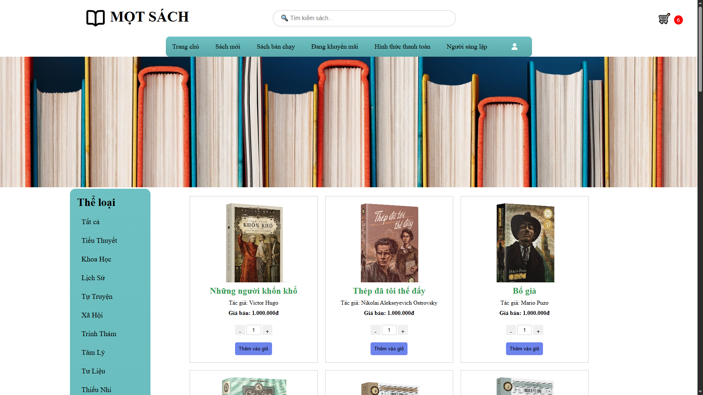
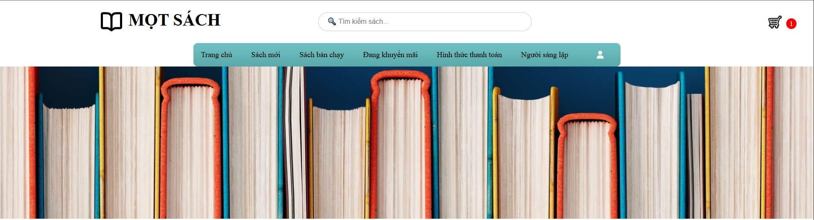
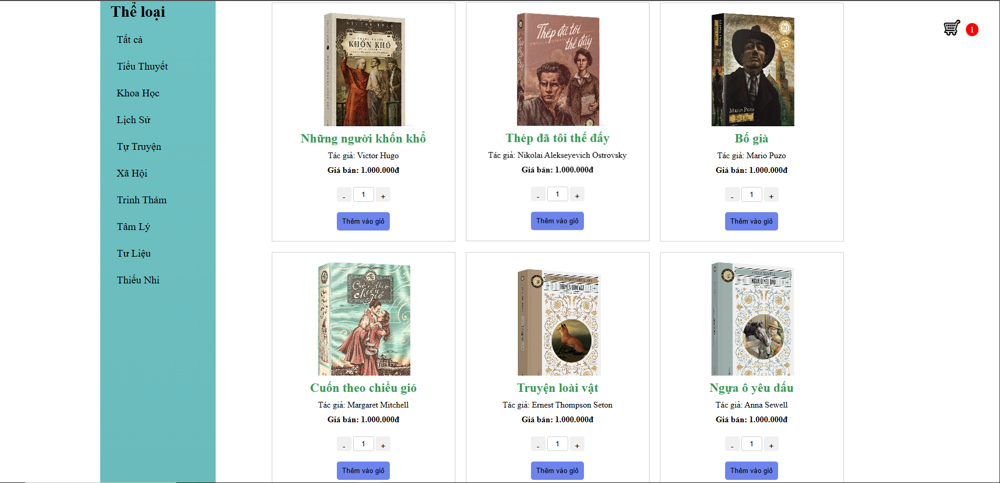
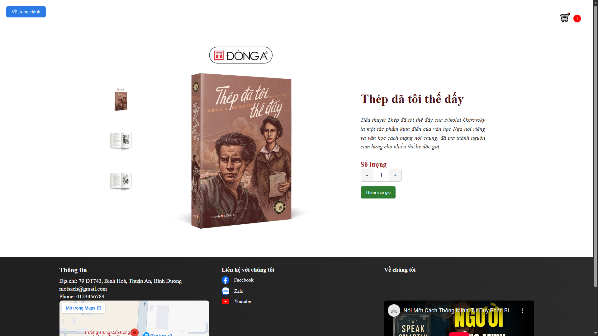
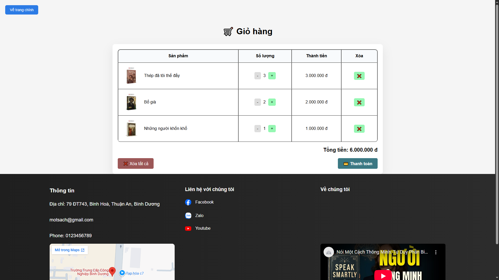
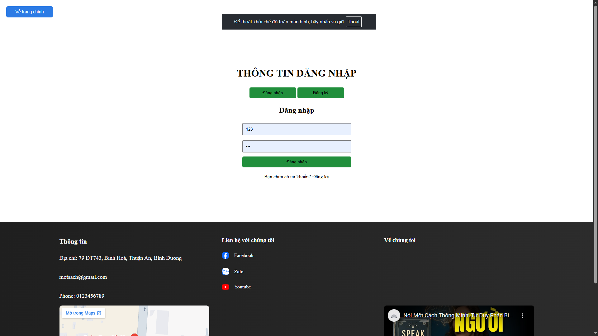
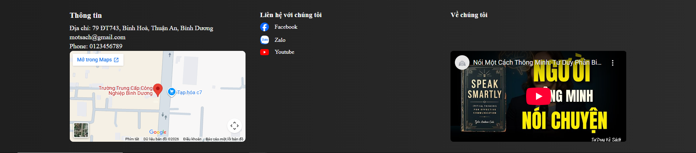

# Giới thiệu sản phẩm: Web bán sách đơn giản được xây dựng bằng HTML, CSS và JavaScript.

## Người thực hiện: 
- Nguyễn Khánh Trung
- Lớp: 24TTH02
- MSSV: 24TH01010
## Chức năng
- Hiển thị danh sách sách
- Thanh điều hướng (navbar)
- Đăng nhập / đăng xuất
- Xem thông tin sản phẩm
- Nút quat lại đầu trang khi cuộn đến 30% trang
## Cách sử dụng
- Mở file index.html để chạy website
- Sử dụng menu để điều hướng giữa các trang
- Đăng nhập để sử dụng các chức năng nâng cao
## Giao diện
- Tên trang web.
- Thanh tìm kiếm theo tên.
- Giỏ hàng hiển thị số lượng đã thêm vào, luôn đi theo khi cuộn chuột.
- Thanh navbar với tính năng lọc card, gắn kèm nút đăng nhập, đăng xuất, đăng ký.
- Banner.

- Nội dung chính chứa card sản phẩm, thông tin sản phẩm, nút thêm vào giỏ theo số lượng trên thanh.
- Sidebar có chức năng lọc theo loại sản phẩm.

- Khi bấm vào hỉnh ảnh trong card sản phẩm sẽ chuyển sang trang chi tiết sản phẩm.

- Giỏ hàng có chức năng tính toán tổng số hóa đơn, có thể thêm bớt hoặc xóa trực tiếp.
- Chỉ có thể thanh toán khi đã đăng nhập
- Khi muốn chọn thêm có thể quay lại trang chủ bằng nút quay lại có trên tất cả các trang điều hướng của web.

- Trang đăng nhập.

- Luôn có footer trên tất cả các trang.

## Demo
https://khanhtrung9865-dev.github.io/motsach/
## Link youtube
https://youtu.be/H4hEdmv_epE
